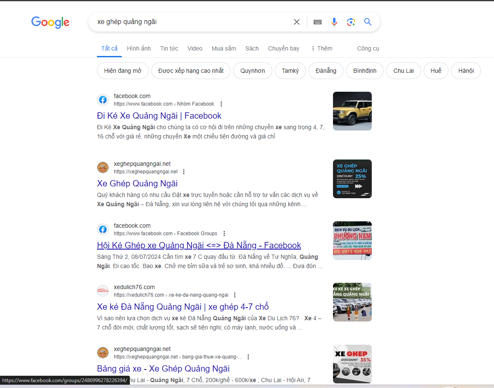
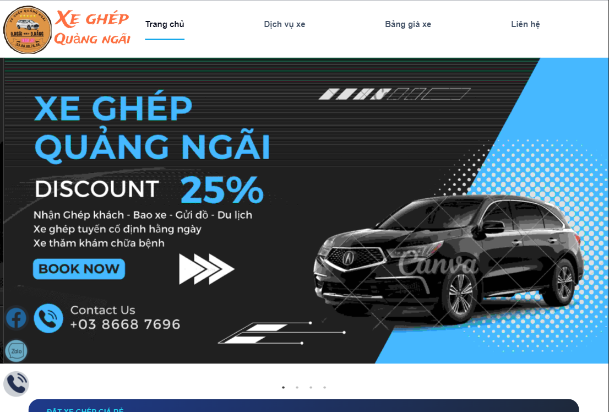
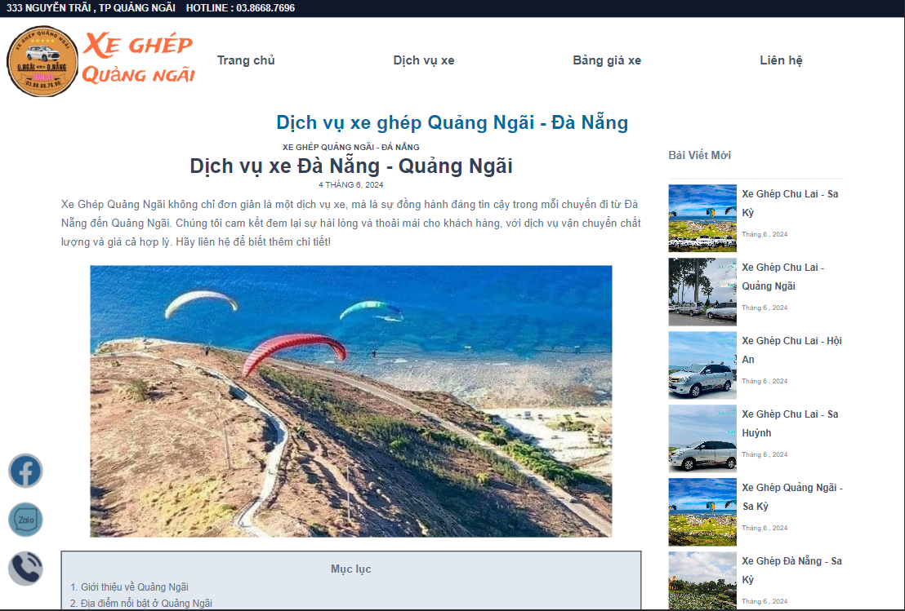

# Xe Ghep Quang Ngai Da Nang
- A web application for booking ticket of Xe Ghep Quang Ngai Da Nang car service.
- This project is built with ReactJS, NodeJS, ExpressJS, MongoDB.
- Focus on SEO on Google Search Engine.


## Features
- Booking ticket
- Manage booking ticket
- Post news
- Update price

## Result
#### Top 2 on Google Search Engine with keyword "Xe gép quảng ngãi" or "Xe ghép quảng ngãi đà nẵng"
<!-- picture ./public/top2search.png -->


#### Home page
<!-- picture ./public/homepage.png -->


#### Post news
<!-- picture ./public/postnews.png -->


## Deploy
- Domain provider: Tenten.vn
- 9/2023 - 3/2024 : Deploy on Google Cloud Compute Engine
- 3/2024 - 4/2024 : Deploy on AWS EC2(Free Tier)
- 4/2024 - present : Deploy on Azure App Service
- Future : Deploy on AWS Amplify and migrate backend to serverless (API Gateway, Lambda, DynamoDB) to reduce cost


## TODO
- [ ] Add more features
- [ ] Convert to Nextjs
- [ ] Deploy to AWS Amplify
- [ ] SEO more keywords
- [ ] Migrate DB(MongoDB) to AWS DocumentDB or DynamoDB
- [ ] Remake UI/UX (Because it's not good)

## THANKS FOR WATCHING
```
```


